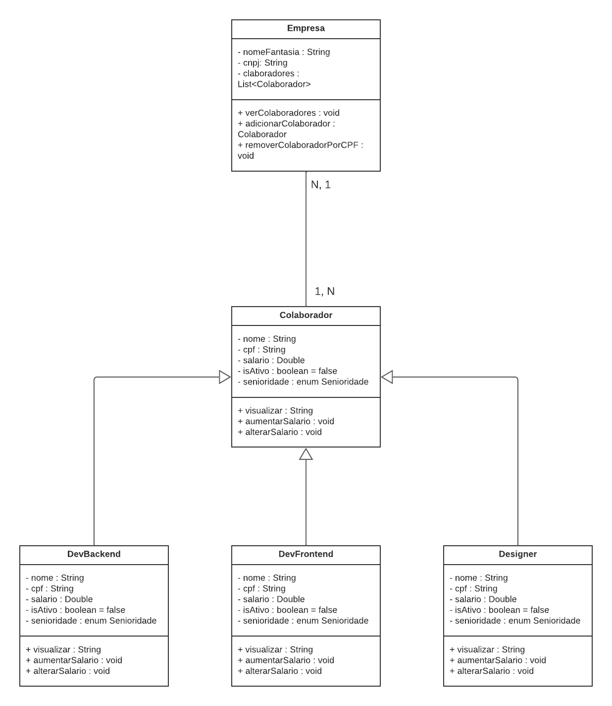

# Classe Colaborador
Classe abstrata contendo os métodos padrões para todos os colaboradores.

Seus atributos são:

* nome : String
* cpf : String
* salario : Double
* isAtivo : boolean = false

São elas e suas funções: 

* ###  visualizar

Retorna uma String contendo informações e todos os atributos da classe.

* ###  aumentarSenioridade 

Aumenta automaticamente a senioridade do colaborador e seu salário de forma proporcional de acordo com a senioridade atual. Seguindo a ordem: 
JR (junior) -> PL(PL) -> SR(senior) -> TL(tech lead)
A ordem respectiva de aumento de salário é vezes: 1.7, 1.6, 1.5

* ###  alterarSalario
Aqui é possível alterar o salário de um colaborador de forma manual. O método tem como parâmetro o novo salário do tipo Double.

# Designer, DevBackEnd, DevFrontEnd
As três classes foram utilizadas apenas como objeto de estudo, todas elas herdam as mesmas funções e atributos de Colaborador.

# Empresa
Esta é uma classe que simula uma empresa com seus dados básicos. Seus atributos são:

* nomeFantasi : String
* cpf : String
* colaboradores : List< Colaboradores >

Aqui estão seus métodos e suas funcionalidades:

* ###  verColaboradores
Este método mostra todos os colaboradores que estão cadastrados na empresa

* ### adicionarColaborador
Aqui é passado um parâmetro do tipo Colaborador e ele é adicionado à lista de colaboradores da empresa. Caso este colaborador já esteja cadastrado na empresa, será mostrado um erro dizendo que um colaborador de mesmo cpf já está cadastrado na empresa.

* ### removerColaboradorPorCPF
Aqui é passado um parâmetro do tipo String que será usado para buscar algum colaborador em que o CPF seja igual aopassado por parâmetro. Caso seja encontrado, esse colaborador será removido da lista de colaboradores da empresa, caso não, irá ser mostrada uma mensagem de erro dizendo que o colaborador não existe nessa empresa.

# Diagrama de Classe

